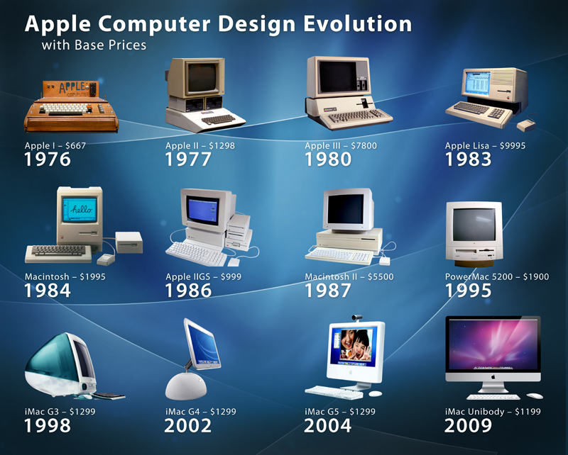

# 💻 Unidade 1 — Introdução à Computação

Primeiro contato com os fundamentos da Computação e sua evolução histórica.

---

## 📖 Apresentação

Nesta unidade foram estudados os conceitos introdutórios da Computação, com foco na evolução histórica dos computadores e no impacto do avanço tecnológico na sociedade.

Ao longo do conteúdo foram abordadas as principais gerações computacionais, desde os primeiros equipamentos eletrônicos até as tecnologias atuais, permitindo compreender como ocorreu o desenvolvimento dos sistemas modernos.

---

## 🎯 Objetivos de Aprendizagem

- Compreender os conceitos fundamentais da Computação;
- Conhecer a evolução histórica dos computadores;
- Identificar as gerações computacionais;
- Entender o papel da tecnologia no desenvolvimento da sociedade;
- Relacionar conceitos históricos com tecnologias atuais.

---

## 🧠 Conteúdo Desenvolvido

### História da Computação

Estudo sobre o surgimento dos computadores e sua transformação ao longo das décadas.

### Evolução Tecnológica

Análise das mudanças que permitiram maior velocidade de processamento, redução de tamanho dos equipamentos e ampliação do acesso à tecnologia.

### Gerações dos Computadores

| Geração | Característica Principal |
|----------|-------------------------|
| Primeira | Utilização de válvulas eletrônicas |
| Segunda | Introdução dos transistores |
| Terceira | Uso de circuitos integrados |
| Quarta | Popularização dos microprocessadores |
| Quinta | Inteligência Artificial e tecnologias emergentes |

---

## 📂 Atividades Desenvolvidas

| Arquivo | Descrição |
|----------|----------|
| atividade-unidade-1.md | Produção textual sobre a evolução histórica da Computação |

---

## 🌎 Importância da Unidade

O estudo introdutório da Computação é essencial para compreender como os avanços tecnológicos influenciam o cotidiano e impulsionam o desenvolvimento científico, econômico e social.

Conhecer a trajetória histórica da área contribui para uma visão mais ampla sobre o papel da tecnologia no presente e no futuro.

---

## 📚 Referências

STALLINGS, William.  
Introdução à Computação.

TANENBAUM, Andrew S.  
Organização Estruturada de Computadores.

Materiais acadêmicos utilizados durante a disciplina.

---

## 👨‍💻 Autor

**Caio Henrique**  
Engenharia de Software — CEUB

---

Desenvolvido para fins acadêmicos.

