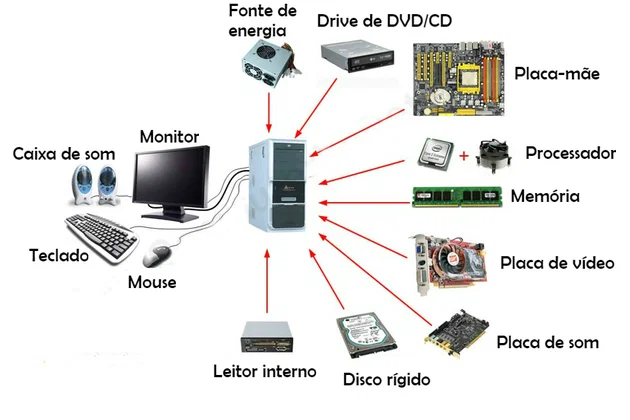

# 🖥️ Unidade 2 — Arquitetura de Hardware e Software

Estudo dos componentes computacionais e da relação entre hardware e software.

---

## 📖 Apresentação

Nesta unidade foram estudados os principais elementos responsáveis pelo funcionamento dos sistemas computacionais, com foco na arquitetura do computador e na interação entre hardware e software.

Também foram abordados os dispositivos de entrada e saída, permitindo compreender como ocorre o processamento e a comunicação entre usuário e máquina.

---

## 🎯 Objetivos de Aprendizagem

- Compreender os conceitos de hardware e software;
- Identificar os componentes fundamentais do computador;
- Entender o funcionamento da arquitetura computacional;
- Conhecer dispositivos de entrada e saída;
- Relacionar os componentes físicos ao processamento das informações.

---

## 🧠 Conteúdo Desenvolvido

### Hardware

Conjunto de componentes físicos responsáveis pelo funcionamento do computador.

Exemplos:
- Processador (CPU)
- Memória RAM
- Placa-mãe
- Armazenamento (HD e SSD)

---

### Software

Conjunto de programas e instruções que permitem executar tarefas e controlar o hardware.

Tipos:

| Categoria | Função |
|----------|----------|
| Sistema | Gerenciar recursos do computador |
| Aplicação | Executar tarefas específicas |
| Utilitário | Auxiliar manutenção e desempenho |

---

### Dispositivos de Entrada e Saída

São responsáveis pela comunicação entre usuário e sistema.

| Entrada | Saída |
|----------|----------|
| Teclado | Monitor |
| Mouse | Impressora |
| Scanner | Projetor |
| Microfone | Alto-falantes |

---

## 📂 Atividades Desenvolvidas

| Arquivo | Descrição |
|----------|----------|
| Evolucao_Componentes.md | Estudo sobre os componentes computacionais |
| Dispositivos_Entrada_Saida.md | Identificação dos dispositivos de entrada e saída |
| Atividade_DispositivosES_16-03.pdf | Atividade prática da unidade |

---

## 🌎 Importância da Unidade

O entendimento da arquitetura computacional permite compreender como os computadores processam informações e como diferentes componentes trabalham em conjunto para executar tarefas.

Esses conhecimentos são fundamentais para o desenvolvimento de soluções tecnológicas e para o estudo das áreas relacionadas à Engenharia de Software.

---

## 📚 Referências

STALLINGS, William.  
Arquitetura e Organização de Computadores.

TANENBAUM, Andrew S.  
Organização Estruturada de Computadores.

Materiais acadêmicos utilizados durante a disciplina.

---

## 👨‍💻 Autor

**Caio Henrique**  
Engenharia de Software — CEUB

---

Desenvolvido para fins acadêmicos.

