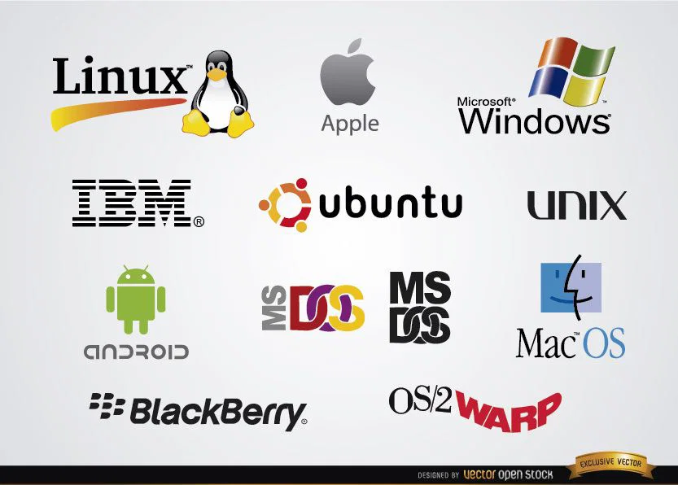

# ⚙️ Unidade 3 — Sistemas Operacionais

Estudo sobre o funcionamento dos sistemas operacionais e sua importância para os sistemas computacionais.

---

## 📖 Apresentação

Nesta unidade foram estudados os conceitos fundamentais dos Sistemas Operacionais e sua função no gerenciamento dos recursos computacionais.

O conteúdo permitiu compreender como ocorre a interação entre software, hardware e usuário, além dos mecanismos utilizados para administrar processos, memória, armazenamento e execução de aplicações.

---

## 🎯 Objetivos de Aprendizagem

- Compreender o papel dos sistemas operacionais;
- Conhecer os principais componentes responsáveis pelo gerenciamento do computador;
- Identificar tipos de sistemas operacionais;
- Entender o funcionamento de processos e memória;
- Relacionar sistemas operacionais ao uso cotidiano da tecnologia.

---

## 🧠 Conteúdo Desenvolvido

### O que é um Sistema Operacional

Software responsável por controlar recursos do computador e permitir a execução de programas.

---

### Principais Funções

| Função | Descrição |
|----------|----------|
| Gerenciamento de Processos | Controla programas em execução |
| Gerenciamento de Memória | Organiza utilização da memória |
| Gerenciamento de Arquivos | Controla armazenamento |
| Interface com Usuário | Permite interação com o sistema |

---

### Tipos de Sistemas Operacionais

| Sistema | Aplicação |
|----------|----------|
| Windows | Computadores pessoais |
| Linux | Servidores e desenvolvimento |
| macOS | Ecossistema Apple |
| Android | Dispositivos móveis |

---

### Recursos Administrados

- Processador
- Memória RAM
- Arquivos
- Dispositivos conectados
- Aplicações em execução

---

## 📂 Atividades Desenvolvidas

| Arquivo | Descrição |
|----------|----------|
| atividade-unidade-3.md | Produção textual sobre Sistemas Operacionais |

---

## 🌎 Importância da Unidade

Os sistemas operacionais são fundamentais para o funcionamento dos dispositivos modernos, pois permitem administrar recursos computacionais de maneira eficiente e segura.

Seu estudo contribui para entender como softwares interagem com o hardware e como ocorre a execução das tarefas realizadas diariamente.

---

## 📚 Referências

TANENBAUM, Andrew S.  
Sistemas Operacionais Modernos.

STALLINGS, William.  
Arquitetura e Organização de Computadores.

Materiais acadêmicos utilizados durante a disciplina.

---

## 👨‍💻 Autor

**Caio Henrique**  
Engenharia de Software — CEUB

---

Desenvolvido para fins acadêmicos.

