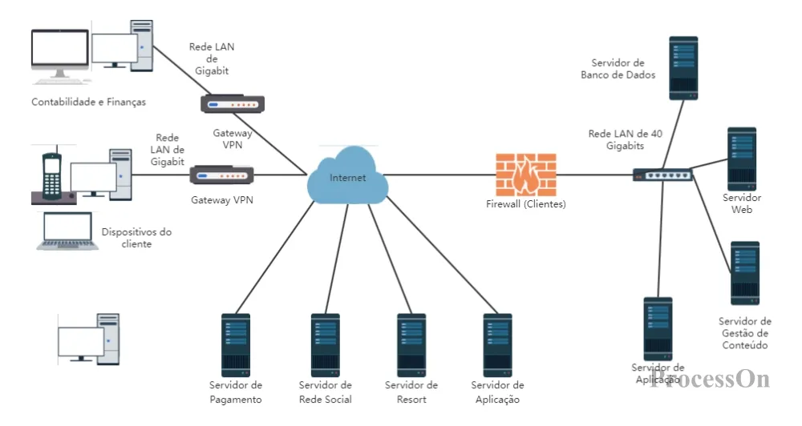

# 🌐 Unidade 4 — Redes de Computadores

Estudo sobre comunicação entre dispositivos, estruturas de rede e transmissão de dados.

---

## 📖 Apresentação

Nesta unidade foram estudados os fundamentos das Redes de Computadores, compreendendo como dispositivos trocam informações e como diferentes estruturas de rede permitem comunicação eficiente.

Também foram abordados os meios de transmissão, os dispositivos de rede e os principais modelos de organização utilizados na infraestrutura computacional.

---

## 🎯 Objetivos de Aprendizagem

- Compreender os conceitos básicos de redes;
- Identificar dispositivos utilizados em comunicação de dados;
- Conhecer os meios de transmissão;
- Entender diferentes topologias de rede;
- Relacionar conectividade e funcionamento da Internet.

---

## 🧠 Conteúdo Desenvolvido

### Dispositivos de Rede

Equipamentos responsáveis pela comunicação e distribuição dos dados.

Exemplos:

- Roteador
- Switch
- Modem
- Access Point
- Servidor

---

### Meios de Transmissão

Formas utilizadas para transportar informações entre dispositivos.

| Meio | Característica |
|----------|----------|
| Cabo metálico | Baixo custo |
| Fibra óptica | Alta velocidade |
| Rede sem fio | Mobilidade |

---

### Topologias de Rede

Modelos utilizados para organizar conexões.

| Topologia | Característica |
|----------|----------|
| Barramento | Estrutura simples |
| Estrela | Mais utilizada atualmente |
| Anel | Comunicação sequencial |
| Malha | Alta redundância |

---

## 📂 Atividades Desenvolvidas

| Arquivo | Descrição |
|----------|----------|
| Aula11_Redes.zip | Material da atividade da unidade |
| dispositivos.png | Exemplos de dispositivos de rede |
| meios_transmissao.png | Tipos de transmissão |
| topologias.png | Modelos de organização de rede |
| reflexao.txt | Registro da atividade desenvolvida |

---

## 🌎 Importância da Unidade

As redes de computadores são essenciais para o funcionamento da sociedade digital atual, permitindo comunicação, compartilhamento de informações e integração entre sistemas.

O entendimento desses conceitos contribui para o desenvolvimento de soluções tecnológicas mais eficientes e conectadas.

---

## 📚 Referências

TANENBAUM, Andrew S.  
Redes de Computadores.

KUROSE, James F.  
Redes de Computadores e a Internet.

Materiais acadêmicos utilizados durante a disciplina.

---

## 👨‍💻 Autor

**Caio Henrique**  
Engenharia de Software — CEUB

---

Desenvolvido para fins acadêmicos.

