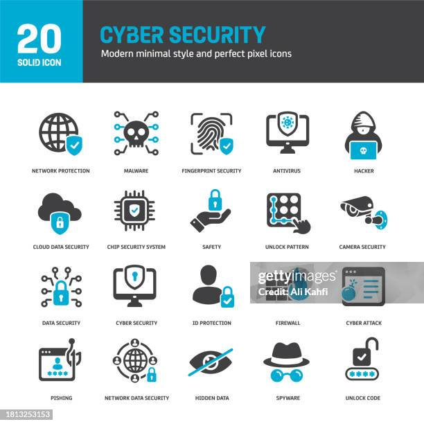

# 🔐 Unidade 5 — Segurança da Informação

Estudo sobre proteção de dados, riscos digitais e práticas de segurança em ambientes computacionais.

---

## 📖 Apresentação

Nesta unidade foram estudados os conceitos fundamentais da Segurança da Informação e sua importância para proteção dos dados e dos sistemas computacionais.

Ao longo do conteúdo foram abordadas práticas voltadas à prevenção de riscos, proteção da privacidade e utilização consciente dos recursos tecnológicos.

---

## 🎯 Objetivos de Aprendizagem

- Compreender os princípios da Segurança da Informação;
- Identificar ameaças digitais e vulnerabilidades;
- Conhecer mecanismos de proteção de dados;
- Entender boas práticas de segurança;
- Desenvolver consciência sobre uso responsável da tecnologia.

---

## 🧠 Conteúdo Desenvolvido

### Segurança da Informação

Área responsável pela proteção das informações contra acessos não autorizados, alterações indevidas ou perdas.

---

### Princípios Fundamentais

| Princípio | Objetivo |
|----------|----------|
| Confidencialidade | Restringir acesso às informações |
| Integridade | Garantir confiabilidade dos dados |
| Disponibilidade | Assegurar acesso quando necessário |

---

### Principais Ameaças

- Malware
- Engenharia Social
- Vazamento de Dados
- Ataques de Rede
- Phishing

---

### Medidas Preventivas

| Medida | Aplicação |
|----------|----------|
| Senhas Fortes | Controle de acesso |
| Backup | Recuperação de dados |
| Atualizações | Correção de vulnerabilidades |
| Antivírus | Proteção contra ameaças |

---

## 📂 Atividades Desenvolvidas

| Arquivo | Descrição |
|----------|----------|
| Avaliacao-3.pdf | Avaliação realizada na unidade |
| Reflexao-Individual.pdf | Reflexão sobre os temas estudados |

---

## 🌎 Importância da Unidade

A Segurança da Informação tornou-se essencial diante do crescimento do uso de sistemas digitais e do aumento dos riscos relacionados ao armazenamento e compartilhamento de dados.

Compreender esses conceitos contribui para o desenvolvimento de práticas mais responsáveis e para a construção de ambientes computacionais mais seguros.

---

## 📚 Referências

STALLINGS, William.  
Segurança de Computadores.

TANENBAUM, Andrew S.  
Redes de Computadores.

Materiais acadêmicos utilizados durante a disciplina.

---

## 👨‍💻 Autor

**Caio Henrique**  
Engenharia de Software — CEUB

---

Desenvolvido para fins acadêmicos.

