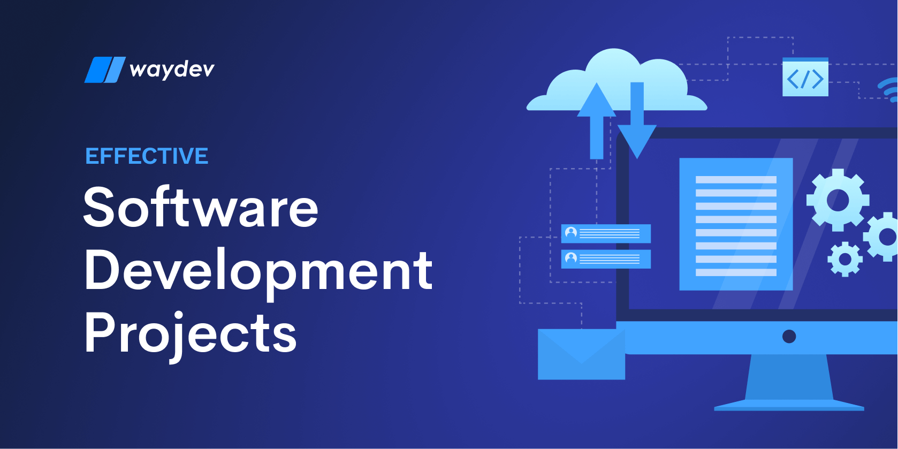

# 🚀 Unidade 6 — Projeto Final

Aplicação dos conhecimentos desenvolvidos ao longo da disciplina de Introdução à Computação.

---

## 📖 Apresentação

Esta unidade representa a etapa de consolidação dos conhecimentos adquiridos durante a disciplina.

O projeto final teve como objetivo reunir os conceitos estudados nas unidades anteriores, promovendo uma visão integrada sobre Computação, arquitetura computacional, sistemas operacionais, redes e segurança da informação.

---

## 🎯 Objetivos de Aprendizagem

- Aplicar os conceitos estudados durante a disciplina;
- Desenvolver organização e documentação técnica;
- Consolidar conhecimentos introdutórios da Computação;
- Relacionar teoria e prática em atividades acadêmicas;
- Produzir registros organizados para consulta futura.

---

## 🧠 Conteúdos Integrados

Ao longo do projeto foram retomados conhecimentos relacionados a:

| Unidade | Tema |
|----------|----------|
| Unidade 1 | Introdução à Computação |
| Unidade 2 | Hardware e Software |
| Unidade 3 | Sistemas Operacionais |
| Unidade 4 | Redes de Computadores |
| Unidade 5 | Segurança da Informação |

---

## 📂 Entregáveis

| Item | Descrição |
|----------|----------|
| README.md | Documentação da unidade |
| atividades/ | Arquivos relacionados ao projeto |
| imagens | Recursos visuais utilizados |

---

## 🏆 Resultados Obtidos

Durante o desenvolvimento desta unidade foi possível consolidar conhecimentos técnicos e desenvolver maior compreensão sobre os fundamentos da área de Computação.

A organização do repositório também permitiu registrar de forma estruturada as atividades realizadas durante a disciplina.

---

## 🌎 Considerações Finais

A disciplina proporcionou uma visão ampla sobre conceitos fundamentais da Computação e contribuiu para o desenvolvimento acadêmico na área de Engenharia de Software.

O repositório funciona como registro das atividades e dos conteúdos estudados ao longo do semestre.

---

## 📚 Referências

Materiais acadêmicos utilizados durante a disciplina.

Bibliografia complementar recomendada durante as aulas.

Documentações e conteúdos estudados ao longo do curso.

---

## 👨‍💻 Autor

**Caio Henrique**  
Engenharia de Software — CEUB

---

Desenvolvido para fins acadêmicos.

